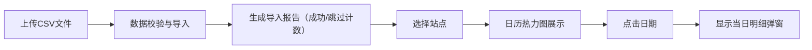

## 1. 产品概述

乡镇供水站水质数据可视化分析工具，帮助站长通过日历热力图快速复盘浊度与pH异常集中的日期，提升水质管理效率。

- 核心价值：将手工记录的CSV水质数据转化为直观的日历热力图，一眼识别异常日期
- 目标用户：乡镇供水站站长、水质管理人员

## 2. 核心功能

### 2.1 用户角色
本系统无角色区分，所有用户拥有完整操作权限。

### 2.2 功能模块
1. **数据导入模块**：CSV文件上传、数据校验、导入报告
2. **日历热力图**：按日聚合的异常状态可视化展示
3. **站点筛选**：下拉选择供水站点，切换查看数据
4. **日期明细**：点击日历查看当日原始数据明细
5. **样例数据**：提供样例CSV供测试使用

### 2.3 页面详情
| 页面名称 | 模块名称 | 功能描述 |
|-----------|-------------|---------------------|
| 主页面 | CSV导入区 | 拖拽或点击上传CSV文件，显示导入进度和结果报告 |
| 主页面 | 站点选择器 | 下拉菜单选择查看的供水站点 |
| 主页面 | 日历热力图 | 矩阵式日历展示，绿色=正常，橙色=异常，支持月份切换 |
| 主页面 | 日期明细弹窗 | 点击日历单元格显示当日所有原始数据记录 |
| 主页面 | 统计摘要 | 显示当前站点的异常天数、正常天数、数据总览 |

## 3. 核心流程

### 用户操作流程
1. 用户访问应用首页
2. 下载样例CSV了解数据格式
3. 上传包含date、station_id、turbidity_ntu、ph列的CSV文件
4. 系统校验并导入数据，跳过缺少date的行，显示导入报告（成功数/跳过数）
5. 用户从下拉菜单选择要查看的站点
6. 日历热力图展示该站点每日水质状态（绿/橙）
7. 用户点击某一天，弹窗显示当日所有原始记录明细
8. 用户可切换月份查看不同时期数据

## 4. 用户界面设计

### 4.1 设计风格
- **主色调**：深蓝色系（#1e3a5f），体现水务专业感
- **辅助色**：绿色（#22c55e）表示正常，橙色（#f97316）表示异常
- **字体**：采用 Noto Sans SC 中文显示字体，搭配现代无衬线字体
- **布局**：卡片式布局，顶部导航 + 左侧控制面板 + 主内容区日历
- **交互**：悬停高亮、平滑过渡动画、点击反馈

### 4.2 页面设计概述
| 页面名称 | 模块名称 | UI元素 |
|-----------|-------------|-------------|
| 主页面 | 顶部导航栏 | 应用标题、样例CSV下载按钮 |
| 主页面 | 左侧控制区 | CSV上传组件、站点下拉选择器、统计摘要卡片 |
| 主页面 | 主内容区 | 月份切换器、7列日历矩阵、颜色图例 |
| 主页面 | 明细弹窗 | 日期标题、数据表格、关闭按钮 |

### 4.3 响应式
- 桌面端（>1024px）：左右布局，控制区25% + 日历区75%
- 平板端（768-1024px）：上下布局，控制区置顶
- 移动端（<768px）：单列布局，日历自适应宽度

## 5. 数据聚合与异常规则

### 5.1 聚合规则
- 按 date + station_id 分组
- turbidity_ntu：取当日最大值
- ph：计算与7.0的偏差绝对值，取当日最大值 `max(|ph - 7.0|)`

### 5.2 异常判定规则
当日为异常日，当且仅当满足以下任一条件：
- turbidity_ntu 最大值 > 1.0
- ph 偏差绝对值最大值 > 0.5

### 5.3 数据质量控制
- 跳过缺少date字段的行
- 导入报告中统计：总行数、成功导入数、跳过行数（缺date）
