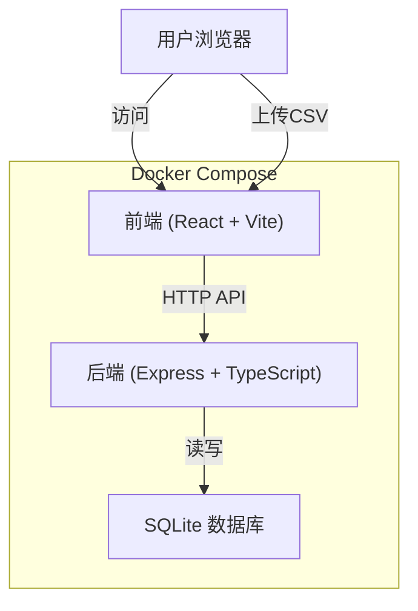
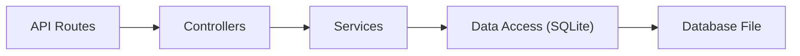

## 1. 架构设计



## 2. 技术选型

| 层级 | 技术栈 | 说明 |
|------|--------|------|
| 前端 | React 18 + TypeScript + Vite 5 + Tailwind CSS 3 + Zustand | 单页应用，现代化构建工具 |
| 后端 | Express 4 + TypeScript | RESTful API 服务 |
| 数据库 | SQLite 3 | 轻量级文件数据库，无需额外服务 |
| CSV解析 | csv-parser | 流式解析CSV文件 |
| 容器化 | Docker + Docker Compose | 一键部署 |

## 3. 项目结构

```
.
├── docker-compose.yml          # Docker Compose 配置
├── .trae/documents/            # 文档目录
├── frontend/                   # 前端项目
│   ├── src/
│   │   ├── components/         # 组件
│   │   │   ├── CalendarHeatmap.tsx    # 日历热力图
│   │   │   ├── CsvUploader.tsx        # CSV上传组件
│   │   │   ├── StationSelector.tsx    # 站点选择器
│   │   │   ├── DayDetailModal.tsx     # 日期明细弹窗
│   │   │   └── StatsCard.tsx          # 统计卡片
│   │   ├── hooks/              # 自定义Hooks
│   │   ├── store/              # Zustand状态管理
│   │   ├── utils/              # 工具函数
│   │   ├── types/              # TypeScript类型定义
│   │   ├── App.tsx
│   │   └── main.tsx
│   ├── Dockerfile
│   └── package.json
├── backend/                    # 后端项目
│   ├── src/
│   │   ├── controllers/        # 控制器
│   │   │   ├── import.controller.ts
│   │   │   └── data.controller.ts
│   │   ├── services/           # 业务逻辑
│   │   │   ├── import.service.ts
│   │   │   └── data.service.ts
│   │   ├── models/             # 数据模型
│   │   │   └── db.ts
│   │   ├── types/              # 类型定义
│   │   ├── utils/              # 工具函数
│   │   └── server.ts
│   ├── Dockerfile
│   └── package.json
└── sample-data/
    └── sample.csv              # 样例CSV数据
```

## 4. 路由定义

| 路由 | 方法 | 用途 |
|-------|------|---------|
| `/api/import` | POST | 上传并导入CSV数据 |
| `/api/stations` | GET | 获取所有站点列表 |
| `/api/daily-summary` | GET | 获取按日聚合的异常数据 |
| `/api/day-detail` | GET | 获取某日的原始明细数据 |
| `/api/sample.csv` | GET | 下载样例CSV |

## 5. API 定义

### 5.1 类型定义

```typescript
// 原始数据记录
interface WaterRecord {
  id: number;
  date: string;           // YYYY-MM-DD
  station_id: string;
  turbidity_ntu: number;
  ph: number;
  created_at: string;
}

// 按日聚合摘要
interface DailySummary {
  date: string;
  station_id: string;
  max_turbidity: number;
  max_ph_deviation: number;  // |ph - 7.0| 的最大值
  is_anomaly: boolean;       // 异常日标记
}

// 导入报告
interface ImportReport {
  total_rows: number;
  imported_rows: number;
  skipped_rows: number;
  skipped_reasons: string[];
}
```

### 5.2 导入CSV
- **POST** `/api/import`
- **Content-Type**: `multipart/form-data`
- **参数**: `file` (CSV文件)
- **响应**:
```typescript
{
  success: boolean;
  data: ImportReport;
}
```

### 5.3 获取站点列表
- **GET** `/api/stations`
- **响应**:
```typescript
{
  success: boolean;
  data: string[];  // station_id 数组
}
```

### 5.4 获取按日聚合数据
- **GET** `/api/daily-summary?station_id={station_id}&year={year}&month={month}`
- **参数**: 
  - `station_id`: 站点ID
  - `year`: 年份（如2024）
  - `month`: 月份（1-12）
- **响应**:
```typescript
{
  success: boolean;
  data: DailySummary[];
}
```

### 5.5 获取某日明细
- **GET** `/api/day-detail?station_id={station_id}&date={date}`
- **参数**:
  - `station_id`: 站点ID
  - `date`: 日期（YYYY-MM-DD）
- **响应**:
```typescript
{
  success: boolean;
  data: WaterRecord[];
}
```

## 6. 服务器架构



## 7. 数据模型

### 7.1 ER图

```mermaid
erDiagram
    WATER_RECORDS {
        INTEGER id PK
        TEXT date "YYYY-MM-DD, NOT NULL"
        TEXT station_id "NOT NULL"
        REAL turbidity_ntu "NOT NULL"
        REAL ph "NOT NULL"
        TEXT created_at "DEFAULT CURRENT_TIMESTAMP"
    }

    INDEX {
        idx_date_station "(date, station_id)"
    }
```

### 7.2 DDL

```sql
CREATE TABLE IF NOT EXISTS water_records (
    id INTEGER PRIMARY KEY AUTOINCREMENT,
    date TEXT NOT NULL,
    station_id TEXT NOT NULL,
    turbidity_ntu REAL NOT NULL,
    ph REAL NOT NULL,
    created_at TEXT DEFAULT CURRENT_TIMESTAMP
);

CREATE INDEX IF NOT EXISTS idx_date_station ON water_records (date, station_id);
CREATE INDEX IF NOT EXISTS idx_station ON water_records (station_id);
```

## 8. Docker Compose 配置

```yaml
version: '3.8'

services:
  backend:
    build: ./backend
    ports:
      - "3001:3001"
    volumes:
      - ./data:/app/data
    environment:
      - PORT=3001
      - DB_PATH=/app/data/water.db
    restart: unless-stopped

  frontend:
    build: ./frontend
    ports:
      - "8080:80"
    depends_on:
      - backend
    restart: unless-stopped
```
